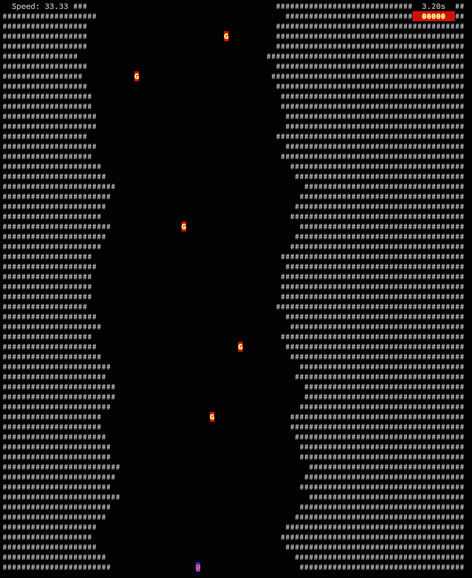

caverun
========

> a fast-paced console cave runner

caverun is a very small python console game. Lead your (ship?) through a cave without colliding with
the walls.

Started as a hobby project to catch some python. Turned out to be funny, let's have
a look where it leads to.

Usage
-------
Use your left/right arrow keys to move your caveman (bottom of screen), so that he
does not collide with the walls. Every 10 seconds, the difficulty is increased... slightly (muahah).

Screen shot
-------------

(Planned) Features
------------------
* completely console-based
* increasing difficulty every 10 secs:
  * speed
  * wall "wobblicity"
  * (_planned_) cave width
* (_planned_) Gold Gems!
* (_planned_) Enemies!
* (_planned_) Highscore

License
--------
It's.My.Own. Take it, do whatever you want, but 1) don't blame me for any harm done by that little game and
2) keep me informed if you enhance it / use it / play it! Thanks.
